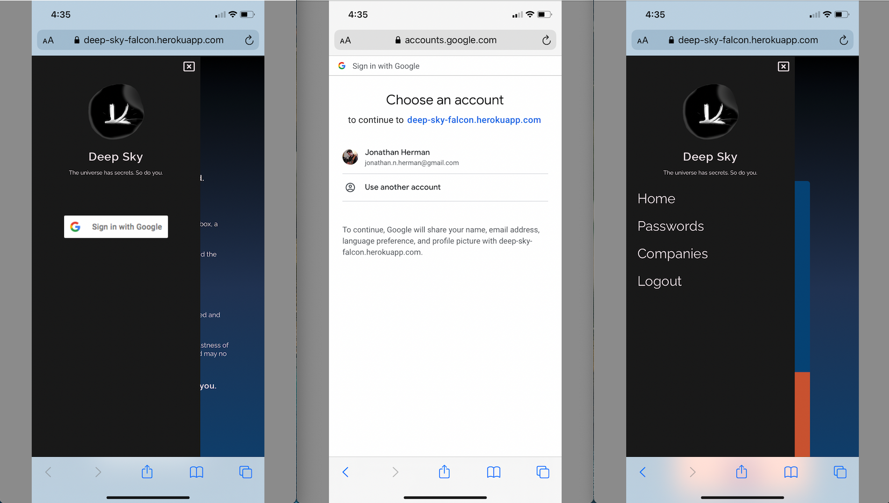
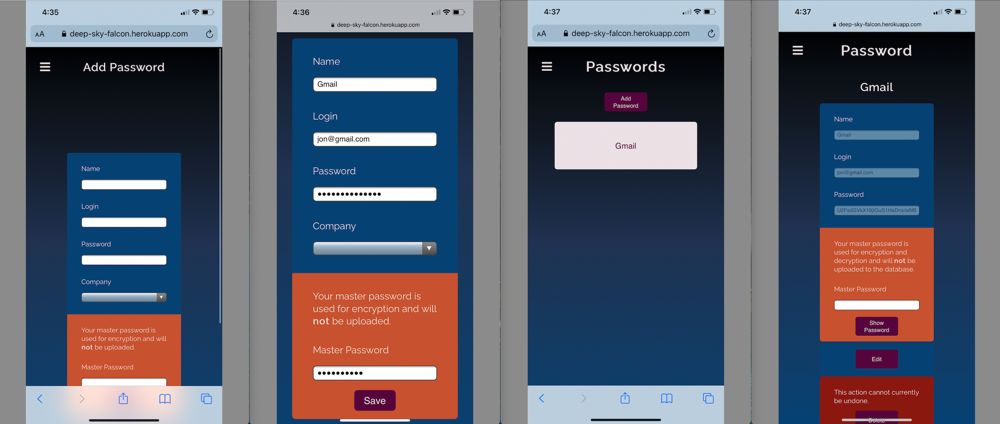
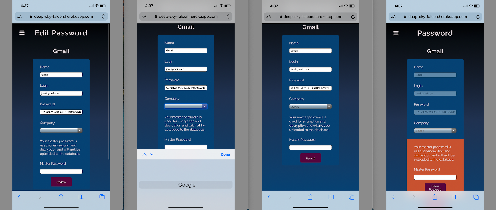
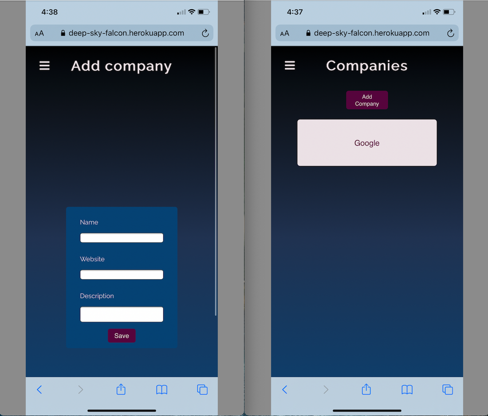

# [Deep Sky](https://deep-sky-falcon.herokuapp.com/)

Welcome to *Falcon*, friend.

Our world is filled with adversaries.

In the past, security meant a lock on a steel box, a weapon, or even a fortress.

Today, we are more connected than ever, and the challenges to protecting our information are everywhere.

We must communicate securely to survive.

Come aboard *Falcon*, your spaceship, inspired and rooted in earth's fastest creature.

As you hurtle through the darkness in the vastness of the *deep sky*, we wish you bon voyage - and may no one ever catch your secrets.

**The universe has secrets. So do you.**

## Background

Deep Sky is a secure vault for your digital life. The current app supports storing passwords with AES-256 encryption.

## Getting Started

1. **[Launch the Deep Sky web app](https://deep-sky-falcon.herokuapp.com/)**
2. Sign in with Google OAuth
3. Securely create, read, update, and delete passwords.

***Note: Do not forget your master password! We do not store your master password anywhere, so make it strong and memorable!***

--- 
## Screenshots

#### Home Page Logged Out and Logged In

#### Custom Offcanvas Nav Bars Logged Out/In and Google OAuth

#### Add Password

#### Edit Password

#### Add Company

#### Validation Errors

## Features

- AES-256 encryption
- Mobile and dark mode-first design
- MVC architecture
- Google OAuth authentication
- Full CRUD (Create, Read, Update, Delete) operations
- Master password authorization (We never store your master password!)
- User error feedback

## Technologies Used

- JavaScript
- HTML
- CSS
- EJS
- NodeJS
- Express
- MongoDB
- Mongoose
- PassportJS
- Google OAuth

Check out the [package.json](package.json) for full list of dependencies.

[Google Slides Presentation](https://docs.google.com/presentation/d/142vM1uzHUFYpI90HmPZgswbu0zUGP-fPzu4wgRyqZ6Q/edit?usp=sharing)

## Next Steps

[View the backlog on Trello board](https://trello.com/b/97UdxPgj/ga-sei-unit-2-project-deep-sky)