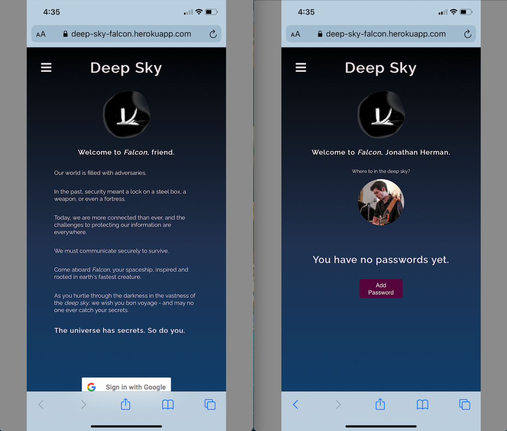
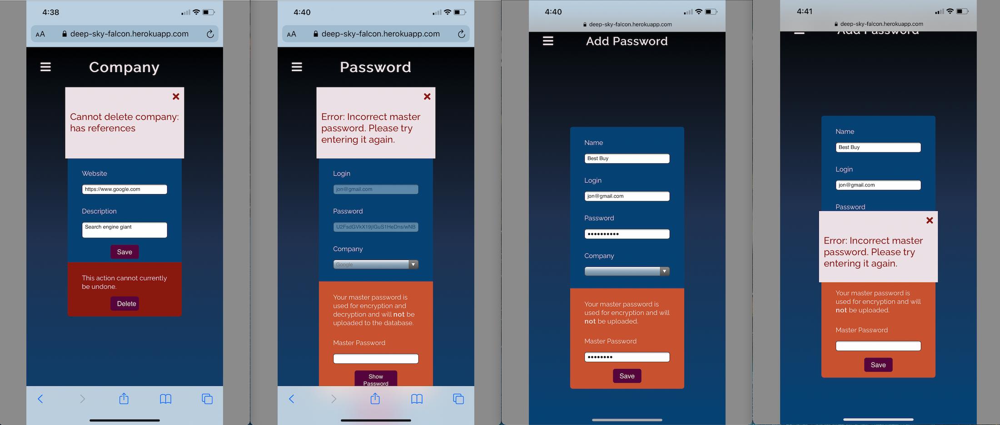

# [Deep Sky](https://deep-sky-falcon.herokuapp.com/)

Welcome to *Falcon*, friend.

Our world is filled with adversaries.

In the past, security meant a lock on a steel box, a weapon, or even a fortress.

Today, we are more connected than ever, and the challenges to protecting our information are everywhere.

We must communicate securely to survive.

Come aboard *Falcon*, your spaceship, inspired and rooted in earth's fastest creature.

As you hurtle through the darkness in the vastness of the *deep sky*, we wish you bon voyage - and may no one ever catch your secrets.

**The universe has secrets. So do you.**

## Background

Deep Sky is a secure vault for your digital life. The current app supports storing passwords with AES-256 encryption.

## Getting Started

1. **[Launch the Deep Sky web app](https://deep-sky-falcon.herokuapp.com/)**
2. Sign in with Google OAuth
3. Securely create, read, update, and delete passwords.

***Note: Do not forget your master password! We do not store your master password anywhere, so make it strong and memorable!***

--- 
## Screenshots

#### Home Page Logged Out and Logged In

#### Custom Offcanvas Nav Bars Logged Out/In and Google OAuth

#### Add Password

#### Edit Password

#### Add Company

#### Validation Errors

## Features

- [AES-256 encryption](#npm-package-crypto-js)
- Mobile and dark mode-first design
- MVC architecture
- Google OAuth authentication
- Full CRUD (Create, Read, Update, Delete) operations
- Master password authorization (We never store your master password!)
- User error feedback

## Technologies Used

- JavaScript
- HTML
- CSS
- EJS
- NodeJS
- Express
- MongoDB
- Mongoose
- PassportJS
- Google OAuth

Check out the [package.json](package.json) for full list of dependencies.

## Next Steps

[View the backlog on Trello board](https://trello.com/b/97UdxPgj/ga-sei-unit-2-project-deep-sky)

## Credits

### Software

<h4 id="npm-package-crypto-js">CryptoJS</h4>

[npm package](https://www.npmjs.com/package/crypto-js)

[License](https://github.com/brix/crypto-js/blob/develop/LICENSE) used under [The MIT License (MIT)](http://opensource.org/licenses/MIT)

Copyright (c) 2009-2013 Jeff Mott  
Copyright (c) 2013-2016 Evan Vosberg

Permission is hereby granted, free of charge, to any person obtaining a copy
of this software and associated documentation files (the "Software"), to deal
in the Software without restriction, including without limitation the rights
to use, copy, modify, merge, publish, distribute, sublicense, and/or sell
copies of the Software, and to permit persons to whom the Software is
furnished to do so, subject to the following conditions:

The above copyright notice and this permission notice shall be included in
all copies or substantial portions of the Software.

THE SOFTWARE IS PROVIDED "AS IS", WITHOUT WARRANTY OF ANY KIND, EXPRESS OR
IMPLIED, INCLUDING BUT NOT LIMITED TO THE WARRANTIES OF MERCHANTABILITY,
FITNESS FOR A PARTICULAR PURPOSE AND NONINFRINGEMENT. IN NO EVENT SHALL THE
AUTHORS OR COPYRIGHT HOLDERS BE LIABLE FOR ANY CLAIM, DAMAGES OR OTHER
LIABILITY, WHETHER IN AN ACTION OF CONTRACT, TORT OR OTHERWISE, ARISING FROM,
OUT OF OR IN CONNECTION WITH THE SOFTWARE OR THE USE OR OTHER DEALINGS IN
THE SOFTWARE.
  